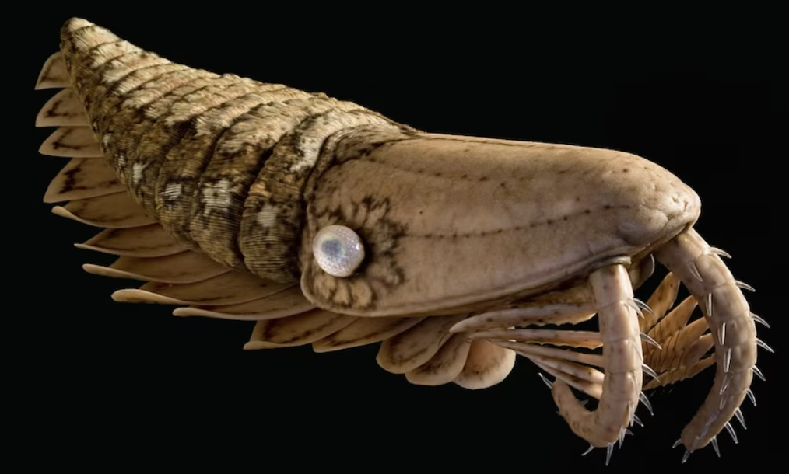

# Cambrian

A self-reproducing code factory. Cambrian reads a specification, calls an LLM, and produces a complete working codebase — including a new instance of itself capable of doing the same thing.

<p align="center">
  
</p>

## Status

**Stage 2 ready — Gen-1 promoted, awaiting autonomous reproduction.**

What's done:
- Phase 0: Supervisor, Test Rig, Docker image, gen-0 validated end-to-end
- Stage 1: Gen-1 Prime written (human + Claude Code), passes Test Rig (34 tests, all green)
- Code review: 12 issues found and fixed across spec, infrastructure, and Gen-1

Next: start Gen-1 in a container, it autonomously produces Gen-2 via LLM (Sonnet). Then Gen-2 produces Gen-3. Gen-3 passing the Test Rig = M1 complete.

## The Idea

Code is disposable. The specification is the genome.

An LLM-powered organism ("Prime") reads a spec and regenerates the entire codebase from scratch each generation. No diffs, no accumulated cruft, no path dependence. A mechanical test rig — no LLM involved — decides if the result is viable. If it is, the offspring replaces the parent. If not, it's discarded.

This came from [Loom](https://github.com/lispmeister/loom), which tried source-code-level self-modification in ClojureScript. Loom proved the pipeline works (72 generations, 1 autonomous promotion) and that editing existing code is the wrong abstraction. Cambrian applies that lesson: evolve the genotype (spec), regenerate the phenotype (code) from scratch.

## Architecture

Three components:

- **Prime** — The organism. Reads the spec, calls an LLM, produces a complete codebase, asks the Supervisor to verify it. Contains its own source, its spec, and its running process.
- **Supervisor** — Host infrastructure. Manages Docker containers, tracks generation history, executes promote/rollback. Not part of the organism — it persists across generations.
- **Test Rig** — Mechanical verification. Builds the artifact, runs tests, starts the process, checks health. Returns a binary viability verdict. No LLM involved.

```
  ┌───────────┐       ┌──────────────┐       ┌───────────┐
  │   Prime   │──────▶│  Supervisor  │──────▶│ Test Rig  │
  │ (organism)│  API  │    (host)    │ spawn │(container)│
  └───────────┘       └──────────────┘       └───────────┘
       │                     │                      │
       │ reads spec          │ manages lifecycle    │ builds, tests,
       │ calls LLM           │ tracks history       │ health-checks
       │ writes artifact     │ promotes/rolls back  │ writes report
```

## Repos

| Repo | Purpose |
|------|---------|
| [cambrian](https://github.com/lispmeister/cambrian) | Specs, Supervisor, Test Rig, Docker, lab journal |
| [cambrian-artifacts](https://github.com/lispmeister/cambrian-artifacts) | Generated artifacts (gen-0, gen-1, ...) and generation history |

## Milestones

- **M1: Reproduce.** Prime reads a spec, generates a working codebase, passes the test rig. The generated Prime can do the same. Gen-3 passing = M1 complete.
- **M2: Self-modify.** Prime mutates its own spec and tests whether the mutation produces fitter offspring.

## Tech Stack

Everything is Python 3.14 for M1 (free-threaded build deferred to M2).

| Component | Key Libraries |
|-----------|--------------|
| Async I/O | `aiohttp`, `aiodocker`, `asyncio` |
| Validation | `pydantic` v2 (all I/O boundaries) |
| Logging | `structlog` (JSON in containers, key-value in dev) |
| Type checking | `pyright` strict mode |
| Tooling | `uv`, `ruff`, `pytest` + `pytest-asyncio` + `pytest-aiohttp` |

## Project Structure

```
spec/
  CAMBRIAN-SPEC-005.md     — Genome spec (what Prime is — consumed by LLM)
  BOOTSTRAP-SPEC-002.md    — Bootstrap spec (Supervisor, Test Rig, Docker)
  SPEC-STYLE-GUIDE.md      — How to write specs
  archive/                 — Superseded specs (historical reference only)
supervisor/                — Host-side Supervisor (aiohttp server)
test-rig/                  — Mechanical verification pipeline
docker/                    — Dockerfile and build script for cambrian-base
lab-journal/               — Discussion and decision logs
```

## Quick Start

```bash
# Clone both repos
git clone https://github.com/lispmeister/cambrian.git
git clone https://github.com/lispmeister/cambrian-artifacts.git

# Build Docker image
cd cambrian
./docker/build.sh

# Start Supervisor
uv run python -m supervisor

# Start Gen-1 (in another terminal)
docker run --rm \
  -e ANTHROPIC_API_KEY="$ANTHROPIC_API_KEY" \
  -e CAMBRIAN_SUPERVISOR_URL="http://host.docker.internal:8400" \
  -e CAMBRIAN_GENERATION=1 \
  -e CAMBRIAN_MODEL="claude-sonnet-4-6" \
  -v "$(pwd)/../cambrian-artifacts/gen-1:/workspace" \
  --add-host host.docker.internal:host-gateway \
  cambrian-base
```

See [CLAUDE.md](CLAUDE.md) for development conventions and issue tracking workflow.

## License

[MIT](LICENSE)
